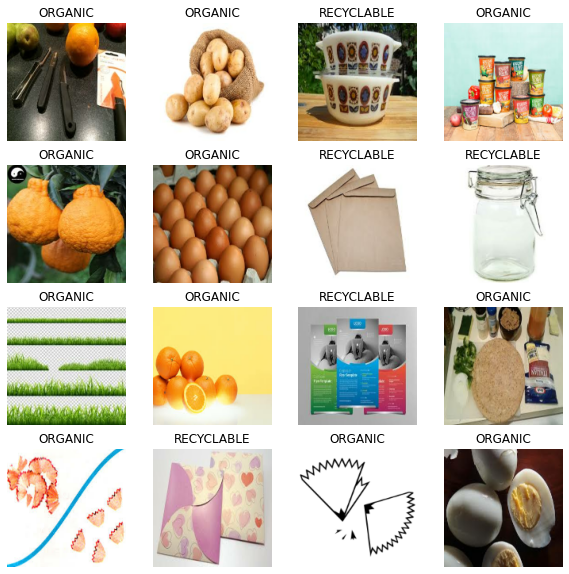
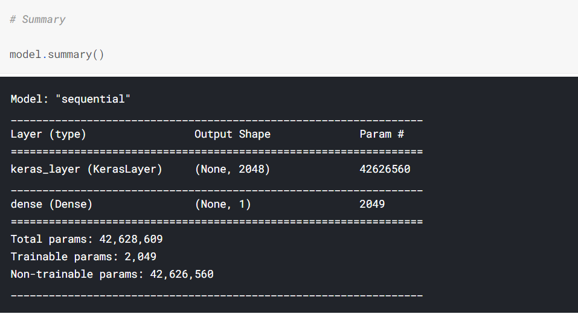
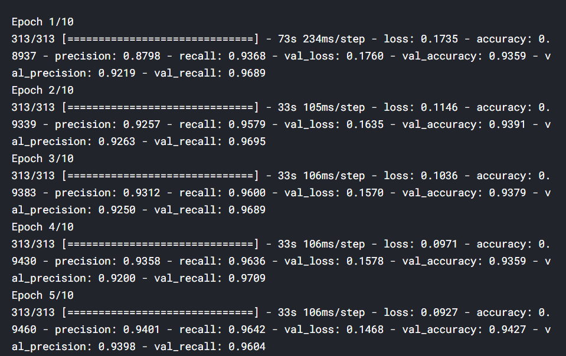
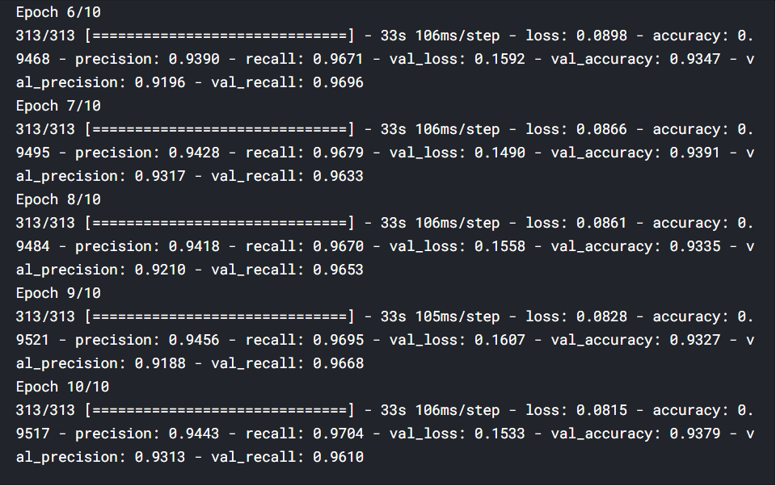
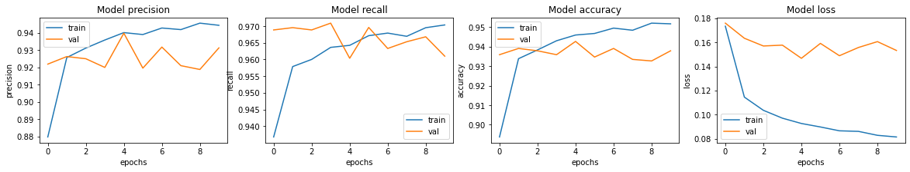
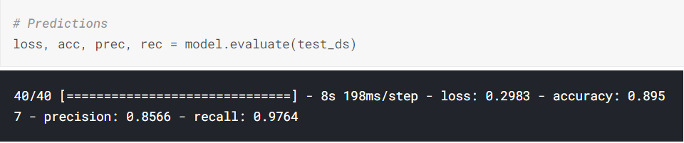

# Waste-Classification
### To classify 22500 images of organic and recyclable objects

**Author** : SHAILESH DHAMA

Waste management is a big problem in our country. Most of the wastes end up in landfills. This leads to many issues like
**Increase in landfills
**Eutrophication
**Consumption of toxic waste by animals
**Leachate
**Increase in toxins
**Land, water and air pollution

### Dataset : https://www.kaggle.com/techsash/waste-classification-data

## Approach:

### Data processing & Exploratory Data Analysis:

    1.Introduction
    2.Loading Libraries and variables
    3.Load the dataset
    4.Visualize the first batch
    5.Correct the data
    6.Model Training
    7.Visualizing model performance
    8.Predict and evaluate results
    
## RESULTS :

#### Sample Labelled Images



#### CNN-Sequential Model Summary



#### Model Training




#### Model performance visualisation



#### Model Prediction on Test Data


### For further information:

Please review the narrative of our analysis in [our jupyter notebook](./Waste%20Classification.ipynb)

For any additional questions, please contact **shaileshettyd@gmail.com)

##### Repository Structure:

```
├── README.md                                                                                                   <- The top-level README for reviewers
├── Waste%20Classification.ipynb                                                                                <- Narrative documentation of analysis
├── https://www.kaggle.com/techsash/waste-classification-data                                                   <- Dataset
└── images                                                                                                      <- generated from code
```
## Citing :

```
@misc{Shailesh:2020,
  Author = {Shailesh Dhama},
  Title = {Waste-Classification},
  Year = {2021},
  Publisher = {GitHub},
  Journal = {GitHub repository},
  Howpublished = {\url{https://github.com/ShaileshDhama/Waste-Classification}}
}
```
